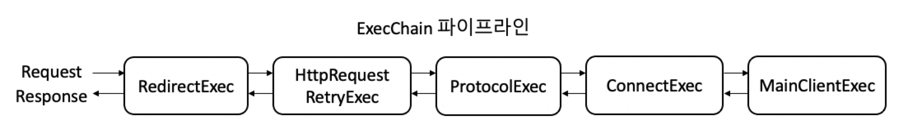

# Apache Http Client5

비동기 I/O 처리가 가능한 Apache 의 새로운 Client 에 대해 알아보자 🔌  

## 목차
- [Apache Http Client5](#apache-http-client5)
  - [목차](#목차)
  - [Apache Client4](#apache-client4)
  - [새로운 Apache Client5](#새로운-apache-client5)
    - [ExecPipeline](#execpipeline)
  - [Connection 의 상태](#connection-의-상태)
  - [Feign Client 에 적용](#feign-client-에-적용)
  - [결론](#결론)
  - [참고](#참고)

## Apache Client4

<div>
    
</div>

우리가 일반적으로 사용하는 Client 는 대부분 동기 방식의 client 인 `4.5.3` Version을 사용하고 있어요 👋  

가장 오랫동안 Java 진영에서 `okHttp` 와 함께 군림하고 있는 Client 라이브러리 중의 하나죠!  

하지만, 이제는 기술이 많이 발전하여 동기 방식보다는 비동기 방식을 지원하는 라이브러리도 많아졌고, 점점 비동기가 가능한 라이브러리로 넘어가고 있죠.  

그에 따라서 우리도 **새로운 Client** 에 대해 알아보려고 합니다ㅎㅎ  

자 가보실까요.? 

## 새로운 Apache Client5

비동기 처리가 가능한 Client5 가 새로나왔습니다! 👏👏  

<div>
    
</div>

인터페이스 명세서도 그래서 `Respnose` 객체가 아닌  
`Future<T>` 방식의 비동기 응답을 받게 됩니다  

또한 전체적인 처리 `Pipeline` 방식이 Netty 와 유사한 형태임을 알 수 있죠  
> Selector 에게 I/O 처리를 위임하여
> 이벤트에 대한 처리를 위임

`IOReactor` 에 의해서 Connection 에 대한 관리 쓰레드와 요청이 처리되는 쓰레드를 분리함으로써 각각의 쓰레드들에 대한 역할을 나눈 모습입니다.  

### ExecPipeline

<div>
    
</div>

각각의 `pipeline` 이 하는 역할은 아래와 같아요

* RedirectExec: Request에 대한 처리는 위임하지만, Response 가 redirect 되는 형태(3xx) 이면 redirect 를 진행한다
* HttpRequestRetryExec: 재시도에 대한 책임을 담당한다. 기본적으로 특정 I/O Exception 을 제외하고는 1초 간격으로 1번 재시도하는 것이 기본 설정입니다.
* ProtocolExec: Request 과 Response 에 인증 혹은 쿠키 처리와 같은 부가적인 일을 수행합니다.
* ConnectExec: Http 연결에 대한 책임을 담당합니다.
* MainClientExec: 직접적으로 Http Request Response 가 이루어지게 됩니다.

여기서 `ConnectExec` 에 대해서 우리는 조금 더 심도 있게 알아볼 것인데요 ㅎㅎ  
왜냐하면, 결국에 `Http Client` 에서의 핵심은 Connection을 어떻게 가져오고 어떻게 관리하는데에 성능의 핵심이 있기 때문이죠!  


## Connection 의 상태

우리가 알고 있는 TCP 를 기반으로 하는 HTTP는 여러 가지 상태가 존재할 수 있어요.  
TCP 에 대한 연결 상태 설명은 [이쪽](https://tech.kakao.com/2016/04/21/closewait-timewait/)에 있어요 🥳  

하지만 Http Client 에서 사용되는 Connection의 경우에는 Http 를 기반의 Connection 상태를 가지게 되는데요 🤔  

저는 여기서 일반적인 상태에 대해 정의를 한번 해보았어요  

|Connection 상태|설명|
|--|--|
|valid|Connection이 정상적으로 맺어졌으며 사용할 수 있는 상태|
|stale|Connection이 연결되었다고 판단된 상태지만, 실제로는 상대방에 의해 끊어진 상태|
|idle|Connection이 연결된 상태이지만, 일정시간 동안 트래픽이 오고 가지 않은 상태|
|closed|Connection이 정상적으로 종료된 상태|

`stale` 상태가 여기서 조금 많이 익숙하지 않을 수가 있는데요.  
배경지식에 대해 설명드리면.!  

<div>
    
</div>

`HTTP` 스펙은 Client 와 Server 가 연결된 상대방에게 통지 하지 않고 Connection을 끊을 수 있습니다.  
그래서 `Http Client Connection Manager` 입장에서 이 Connection 을 사용해도 되는지, 연결되어 있는지 체크해야 됩니다!  
그렇기 때문에 일정 주기로 `stale` check 하는 주기가 존재하는 것이죠  

만약 `stale` 한 상태의 커넥션을 기반으로 실제 요청을 보내면 어떻게 될까요?  
> 실제로 커넥션을 열어보니 닫힌 상태의 응답이 저장되어 있어서
> 이를 열어보니 end of stream 이라는 종결 상태의 buffer 만 남아있는 것이죠

그래서 Client 입장에서 Response 를 파싱하다가 `NoHttpResponse` 를 맞이하게 됩니다.  

결과적으로 Connection 의 상태를 체크하는 주기를 빠르게 하고,  
이상하다고 판단되는 Connection 을 빨리 체크하여 끊고 다시 맺는 것이 중요합니다  

이 옵션이 바로 `setValidateAfterInactivity` 입니다  
기본 옵션은 5초이며, 서버의 상태에 맞게 짧게 조율하는 것이 중요하게 되는 것이죠  

```yaml
logging:
  level:
    org.apache.hc.client5: debug
```

역시나 핵심은 디버그 로그를 키고 하나씩 살펴보는 것이 중요합니다ㅎㅎ  

## Feign Client 에 적용

그러면 실제 코드에 한번 적용하러 가볼까요~?  

Feign Client 내부적으로도 hc5 를 지원하고 있습니다  

```groovy
implementation("io.github.openfeign:feign-hc5")
```

간단하게 의존성을 가져오고 yaml file 에 아래와 같이 설정하면 끝입니다  

```yaml
feign:
  httpclient:
    hc5:
      enabled: true
      pool-reuse-policy: fifo
      pool-concurrency-policy: strict
```

활성화 준비만 된다면, 나머지는 크게 어렵지는 않은 부분입니다.  
물론 커넥션 사용 전략이나 유지 전략은 서버 상태에 맞게 설정하면 됩니다 😄  

다음은 실제 Connection Manager 를 커스텀하는 부분인데요  

```kotlin
@Configuration
@ConditionalOnMissingBean(Client::class, ApacheHttp5Client::class)
class ApacheHttp5Configuration {
    private lateinit var httpClient5: CloseableHttpClient

    @Bean
    @ConditionalOnMissingBean(HttpClientConnectionManager::class)
    fun hc5ConnectionManager(httpClientProperties: FeignHttpClientProperties): HttpClientConnectionManager =
        PoolingHttpClientConnectionManagerBuilder.create()
            .setMaxConnTotal(httpClientProperties.maxConnections)
            .setMaxConnPerRoute(httpClientProperties.maxConnectionsPerRoute)
            .setConnPoolPolicy(
                PoolReusePolicy.valueOf(httpClientProperties.hc5.poolReusePolicy.name)
            )
            .setPoolConcurrencyPolicy(
                PoolConcurrencyPolicy.valueOf(httpClientProperties.hc5.poolConcurrencyPolicy.name)
            )
            .setConnectionTimeToLive(
                TimeValue.of(httpClientProperties.timeToLive, httpClientProperties.timeToLiveUnit)
            )
            .setValidateAfterInactivity(TimeValue.ofSeconds(1L))
            .setDefaultSocketConfig(
                SocketConfig.custom().setSoTimeout(
                    Timeout.of(
                        httpClientProperties.hc5.socketTimeout.toLong(),
                        httpClientProperties.hc5.socketTimeoutUnit
                    )
                ).build()
            )
            .build()

    @Bean
    @ConditionalOnMissingBean(CloseableHttpClient::class)
    fun httpClient5(
        connectionManager: HttpClientConnectionManager,
        httpClientProperties: FeignHttpClientProperties,
    ): CloseableHttpClient {
        httpClient5 = HttpClients.custom().disableCookieManagement().useSystemProperties()
            .setConnectionManager(connectionManager).evictExpiredConnections()
            .setDefaultRequestConfig(
                RequestConfig.custom()
                    .setConnectTimeout(
                        Timeout.of(httpClientProperties.connectionTimeout.toLong(), TimeUnit.MILLISECONDS)
                    )
                    .setRedirectsEnabled(httpClientProperties.isFollowRedirects).build()
            )
            .setRetryStrategy(DefaultHttpRequestRetryStrategy())
            .build()
        return httpClient5
    }

    @Bean
    @ConditionalOnMissingBean(Client::class, ApacheHttp5Client::class)
    fun feignClient(httpClient5: CloseableHttpClient): Client = ApacheHttp5Client(httpClient5)

    @PreDestroy
    fun destroy() {
        httpClient5.close(CloseMode.GRACEFUL)
    }
}

```

기본적인 설정은 `default` 설정과 유사하지만,  
필요한 설정만 추가한 부분이 있어요  
`setValidateAfterInactivity` 를 기본 설정보다 쪼금 짧게 가져간 모습입니다!  

이렇게만 한다면, 기본적인 설정은 전부 끝났습니다  
**Feign Client 를 통해서 CompletableFuture 혹은 Future** 로 응답을 받아와서 비동기 처리할 수 있게 되는 것이죠  

여러분들도 한번 바꿔보는 것은 어떨까요? 🏃  
물론 내부적으로 성능 테스트를 해보는 것을 추천합니다!  

## 결론

이래 저래 말은 많았지만, 결론은 깔끔합니다 💡  

* 기술은 끊임 없이 발전한다. 지속적으로 관심을 갖자
* HttpClient5 는 비동기 처리 방식을 지원한다
* Connection 의 상태를 정확히 진단하자
* Connection Manager 설정은 꼼꼼히 챙기자


## 참고

* [Connection Stale Check](https://hc.apache.org/httpclient-legacy/performance.html#Stale_connection_check)
* [Apache Client: NoHttpResponseException](https://stackoverflow.com/questions/10558791/apache-httpclient-interim-error-nohttpresponseexception)
* [nGrinder에 적용한 HttpCore 5와 HttpClient 5 살펴보기](https://d2.naver.com/helloworld/0881672)
